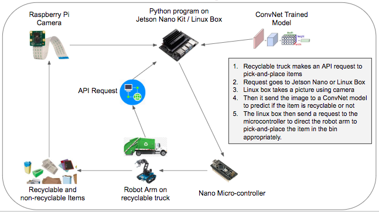

# Solve America's Recycling Problem using Robotic ConvNets
Detection and classification of recyclable items to help recyclable facility robots identify and pick them up correctly

## Hardware Design Model

## Description of Files
 - ### pics folder
   - includes the images of the recyclable and non-recycable objects used in training and validation of ConvNets. 
   - The images were taken using a Mac camera and the OpenCV-Python library
 
 - ### cnn_resnet_load_camera.py
   - Python main program
   - Loaded in Jetson Nano
   - Using OpenCV-Python, opens connection to camera. Takes and reads the picture
   - Load the model on the Jetson Nano kit.
   - Invoke the trained model to read the image and predict the class
   - Based on the prediction, send a signal to the Nano Microcontroller to bin the item correctly
   
 - ### cnn_resnet_h5model.ipynb
   - Program created using Jupyter notebook in Google Colab to create the trained ConvNet model in h5 format
   
 - ### cnn_resnet.ipynb, cnn_inception.ipynb, cnn_vgg.ipynb
   - Programs created using Jupyter notebook in Google Colab to create the trained ConvNet models
   
 - ### picmac.py
   - Program to take images of recyclable and non-recyclable objects using Mac's integrated camera and OpenCV-Python library

 - ### testarduino/djhost/djhost.ino
   - Program loaded in nano microcontroller
   - Moves Smart Servo Motors
   - If value received is 'Y' (i.e. recyclable), it moves them to one place. 
   - If value received is 'N' (i.e. non-recyclable), it moves them to the other place. 
